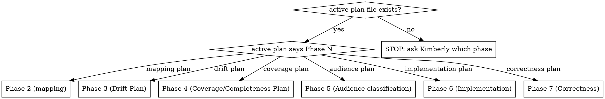

# Syncing gastown updates

## Overview

The gt-wiki tracks stable gastown releases only. Between-release commits are noise the wiki ignores. Each release produces one sync pass that brings the wiki from the previously-documented release tag to the new release tag — updating `file:line` citations, creating pages for new entities, marking removed entities vestigial, resolving previously-recorded drift that upstream has fixed, and capturing new drift that the release introduces.

**Core principle: code-first verification.** The source at `/home/kimberly/repos/gastown/` at the new release tag is authoritative. Wiki pages (even the ones Phase 2 produced from source) are synthesis — they are *also* candidates for drift against the new release, not reference truth. Every update reads source at the new release tag.

**Corollary:** the skill's diff base is always the *previously-documented release tag*, never `HEAD@{1}` or "last commit" or "last log entry date." A release sync is a tag-to-tag operation.

## When to use

Trigger (single, specific):
- Kimberly says "gastown released <version>" (or equivalent), or `git fetch --tags` in `~/repos/gastown` reveals a release tag newer than the previously-documented release, AND Kimberly has confirmed the wiki should move to it.

Not a trigger:
- `~/repos/gastown` has new commits but no new tagged release. **Do nothing.** The wiki tracks releases, not HEAD.
- A pre-release / RC tag. Confirm with Kimberly whether it counts; default is no.
- A hotfix commit on an old release branch with no new tag. Do nothing.
- `gt --help` shows a command without a wiki page. This means the wiki is out-of-date relative to the documented release OR a prior sync missed an entity. If the former, the sync that documents the new release will cover it; if the latter, file a `wants-wiki-entry` bead and handle it inside the active phase, not as an ad-hoc sync.

When NOT to use (even if a new release exists):
- You don't know which phase is active. Read [log.md](../../log.md) headings (`grep "^## \["`) and the active plan in `.claude/plans/` first. Scope decisions depend on phase context.
- The wiki has uncommitted changes. Commit or stash them first — a release sync is a clean-tree operation.
- You're in the middle of an unrelated batch. Finish or park it; don't interleave.
- No release marker exists yet AND this is NOT the first-run case. See "First-run caveat" below.

## First-run caveat

As of the skill's creation (2026-04-14), the wiki does not yet have a release marker recording which gastown release it currently represents. Phase 2 (mapping) ran mid-release-cycle (2026-04-11), which means the wiki's baseline is an untagged gastown commit, not a release tag. Phase 3 (drift analysis, in planning) will inherit the same base.

**First run of this skill** (whenever the next stable release lands):
1. Determine the untagged base manually — the gastown HEAD as of the most recent `ingest` batch in `log.md` (Phase 2 batch 12 on 2026-04-11). Capture its SHA explicitly in the sync's scope proposal.
2. Compare against the newly-published release tag.
3. As part of the first sync's deliverables, **establish the release marker** on the wiki side — location to be decided then (probably a `gastown_release:` frontmatter field on `gastown/README.md`). Record the new release tag in the marker.
4. From that first sync onward, the marker is authoritative and subsequent runs are tag-to-tag as documented throughout this skill.

Every reference to "the previously-documented release tag" below assumes the marker exists. If it doesn't, fall back to the first-run procedure for Step 1 only.

## Load-bearing rules (non-negotiable)

1. **Code-first verification.** Every updated `file:line` citation is re-read from source at the **new release tag**. Never copy a citation from the existing wiki page. If the cited symbol is gone, that's a `wiki-stale` finding — fix inline, log under the `lint` verb.
2. **Don't delete.** Removed entities get `status: vestigial` in frontmatter + an `## Implementation status` section citing the removal commit (by SHA) and the release it first disappeared from. The wiki preserves its own history; deleted pages break backlinks.
3. **Batch-per-commit.** One meaningful change cluster = one batch = one log entry + one commit. Do not sweep a whole release into a monolithic commit.
4. **Phase awareness.** Read the active plan file and the last ~5 `log.md` decision entries before proposing scope. A Phase 2 release sync produces mapping updates; a Phase 3 release sync produces drift-resolution updates. Wrong phase → wrong shape of finding.
5. **Cross-link discipline.** Every updated page passes the 7 Phase 2 rules + 3 Phase 3 extensions (see `CLAUDE.md` and the active plan). Backlink-check every touched page before commit.
6. **Log entry format is mandatory.** Every batch closes with a `log.md` entry matching the phase's batch-entry format — Phase 2's `ingest` format for mapping updates, Phase 3's `drift-found` format for drift updates. See `workflow.md` in this skill directory for the templates.
7. **Tagged releases only.** Do not sync against an untagged commit, a branch HEAD, or a pre-release RC unless Kimberly has explicitly authorized a one-off exception. The wiki's stability contract depends on this.

## Load-bearing rules (non-negotiable)

1. **Code-first verification.** Every updated `file:line` citation is re-read from source at the new release tag. Never copy a citation from the existing wiki page. If the cited symbol is gone, that's a `wiki-stale` finding — fix inline, log under the `lint` verb.
2. **Don't delete.** Removed entities get `status: vestigial` in frontmatter + an `## Implementation status` section citing the removal commit. The wiki preserves its own history; deleted pages break backlinks.
3. **Batch-per-commit.** One meaningful change cluster = one batch = one log entry + one commit. Do not sweep everything into a monolithic commit.
4. **Phase awareness.** Read the active plan file and the last ~5 `log.md` decision entries before proposing scope. A Phase 2 release sync produces mapping updates; a Phase 3 release sync produces drift-resolution updates. Wrong phase → wrong shape of finding.
5. **Cross-link discipline.** Every updated page passes the 7 Phase 2 rules + 3 Phase 3 extensions (see `CLAUDE.md` and the active plan). Backlink-check every touched page before commit.
6. **Log entry format is mandatory.** Every batch closes with a `log.md` entry matching the phase's batch-entry format — Phase 2's `ingest` format for mapping updates, Phase 3's `drift-found` format for drift updates. See `workflow.md` in this skill directory for the templates.

## Phase awareness decision



Phase-specific sync behavior:

- **Phase 2 (mapping):** release sync produces `ingest` batch entries. New entities get full pages; removed entities get vestigial marking; moved `file:line` citations get refreshed.
- **Phase 3 (Drift Plan):** release sync produces `drift-found` and `lint` batch entries. Drift findings get updated (resolved drift → archive with "fixed upstream in <commit>" note; new drift → new finding); wiki-stale findings get fixed inline under the `lint` verb; frontmatter `phase3_audited`, `phase3_findings`, `phase3_severities`, `phase3_findings_post_release` update for every touched page.
- **Phase 4 (Coverage/Completeness Plan):** release sync produces `drift-found` and `ingest` batch entries. New code features that were added since the last release get Phase 4 coverage entries (severity `missing` or `incomplete`); existing coverage findings get re-checked against the new release.
- **Phase 5 (Audience classification):** release sync is a no-op unless audience annotations change upstream (rare). If the sync reveals that a command changed audience (e.g., moved from internal to user-facing), re-classify.
- **Phase 6 (Implementation):** release sync has a special role — it populates the `**PR reference:**` field on findings whose PRs merged in the new release. Any finding whose PR merged gets its status updated to `merged in v<new-tag>` and moves to the archived section of the corrections list.
- **Phase 7 (Correctness):** release sync triggers re-validation. Any finding that was previously `wrong` and got fixed in a PR may now be `ambiguous` or `resolved`; Phase 7 re-audits against the new release to confirm.
- **Between phases or unknown:** STOP. Ask Kimberly. Don't guess.

## Workflow

See [workflow.md](workflow.md) in this skill directory for the full 11-step runbook, with exact commands, templates, and worked examples. The steps are:

1. Establish the delta (`git log`, `git diff --stat`, `git diff --name-status`).
2. Read the active plan file and the last 5 `log.md` decision entries.
3. Triage the diff into buckets: new entities, modified entities, removed entities, internal refactors.
4. Cross-reference the diff against the existing wiki: `grep -l "<changed-path>" gastown/`.
5. Check open beads for `wants-wiki-entry` and drift findings the release may have resolved.
6. **Propose scope to Kimberly before touching files.** This is a phase-discipline move — a release sync is not automatic.
7. Per affected page: re-read source at the new release tag; refresh `file:line`; update `updated:` frontmatter; update phase-specific fields; fold resolved drift into the Drift section.
8. Per new entity: create a full entity page (Phase 2 template) — binaries/commands/packages/etc. per the schema.
9. Per removed entity: mark `status: vestigial` + `## Implementation status` section citing the removal commit.
10. Cross-link checks (backlinks, resolve, bidirectional) on every touched page.
11. Batch entry in `log.md` (format from `workflow.md`) + one commit + push.

## Red flags — STOP and re-read this skill

Any of these mean the discipline is slipping:

- About to commit without having re-read source at the new release tag → STOP.
- About to delete a page for a removed entity → STOP, mark vestigial.
- About to write a `log.md` entry that doesn't list "Sources read" → STOP, use the template.
- About to touch wiki pages without reading the active plan file → STOP, read the plan first.
- About to propose scope broader than one batch → STOP, split it.
- "This is small, I'll skip the phase check" → STOP, check the phase.
- "The wiki page looks right, I'll skip the source re-read" → STOP, wiki pages are not authoritative.
- "I'll batch all the releases since last sync into one log entry" → STOP, one batch = one entry.

## Common mistakes

| Mistake | Fix |
|---------|-----|
| Copying `file:line` citation from existing wiki page | Re-read source at the new release tag; line numbers move. |
| Deleting removed entities' pages | Mark `status: vestigial`, add `## Implementation status` with removal commit. |
| Single monolithic commit for the whole sync | Split per meaningful cluster; one batch, one commit, one log entry. |
| Free-form log entry | Use the phase's batch-entry format from `workflow.md`. |
| Using `--actor kimberly` or default actor for bd commands | Use `BEADS_ACTOR=wiki-curator bd ...` per wiki CLAUDE.md conventions. |
| Inventing new category folders | The schema defines the category set (binaries/, commands/, packages/, files/, roles/, concepts/, workflows/, drift/, inventory/, plugins/). Don't add new ones without a schema decision entry. |
| Updating one page without backlink check | Run `grep -rn "<entity-name>" gastown/` and update every page that references it; add backlinks where missing. |
| Skipping the "propose scope to Kimberly" step | The release sync is not autonomous. Propose the batch list before touching files. |

## Relationship to the active plan

A release sync is not itself a phase — it's a recurring maintenance pass that folds into whichever phase is active. Practical implications:

- **Small releases** (a few commits touching a few files): fold the work into the active phase's plan as an ad-hoc batch with its own log entry. No new plan file needed.
- **Large releases** (major version bump, many files moved or renamed): create a dedicated plan file at `.claude/plans/YYYY-MM-DD-release-sync-v<version>.md` that references the active phase plan and specifies which batches feed findings back into the phase plan.
- **Decision threshold:** if the diff touches >20 wiki pages or introduces >5 new entities, write a dedicated plan file. Otherwise fold into the active phase plan.

## Self-check

Run after completing a release sync batch.

### Coverage checklist

- [ ] Delta is tag-to-tag (not `HEAD@{1}` or "last commit")
- [ ] Release marker exists and was updated to new tag
- [ ] Diff triaged into: new entities, modified entities, removed entities, internal refactors
- [ ] Scope proposal presented to Kimberly BEFORE touching files
- [ ] Every updated page's `file:line` citations re-read at the NEW release tag (not the old one)
- [ ] Removed entities marked `status: vestigial` (not deleted)
- [ ] Batch-per-commit discipline followed (one change cluster = one commit = one log entry)
- [ ] Cross-link checks run on every touched page
- [ ] Phase-specific fields updated per active phase

### Self-check questions

1. **"Is my delta tag-to-tag?"** — Answer should name both tags (e.g. "v1.0.0..v1.1.0"). If one end is a branch or `HEAD`, you broke the contract.
2. **"Did I re-read every cited source at the new tag?"** — If you copied any `file:line` from the existing wiki page without verifying, you skipped code-first verification.
3. **"Did I propose scope to Kimberly before editing?"** — Release syncs are not autonomous. If you started editing without her approval, stop and propose.

### Verification commands

```bash
# Confirm tag-to-tag delta (expect a specific commit count)
git -C ~/repos/gastown log --oneline <old-tag>..<new-tag> | wc -l

# Verify release marker is updated
grep "gastown_release:" ~/repos/gt-wiki/gastown/README.md

# Check no pages were deleted (only vestigial marking allowed)
git diff --cached --diff-filter=D --name-only | grep "gastown/"
```

### Example: good sync vs bad sync

**Bad:** `git log origin/main~10..HEAD` as the delta, no scope proposal, monolithic commit touching 15 pages, removed entity page deleted from disk.

**Good:** `git -C ~/repos/gastown log v1.0.0..v1.1.0 --stat` as the delta, scope proposal filed and approved, 3 commits (new entities batch, modified entities batch, vestigial marking batch), removed entity marked `status: vestigial` with `## Implementation status` citing removal commit.

## Reference

- `workflow.md` — full 11-step runbook with commands, templates, and worked examples.
- [CLAUDE.md](../../../CLAUDE.md) — wiki schema (section conventions, frontmatter fields, page types, cross-link discipline).
- [log.md](../../../log.md) — existing batch entries to pattern-match against.
- `.claude/plans/` — active phase plan(s).
